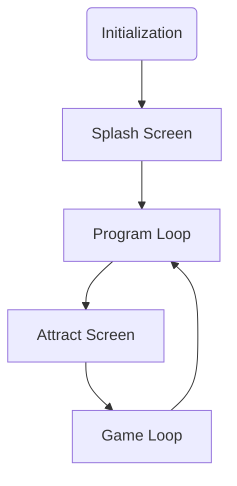

# Game Template

## Introduction

This is a template project for creating a game to run on the following neo-retro systems:

* Agon Light 2
* Aquarius+
* Commander X16
* ZX Spectrum Next

## Basic Game Structure

