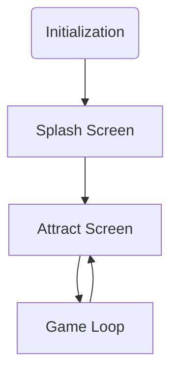

# Game Template

## Introduction

This is a template project for creating a game to run on the following neo-retro systems:

* Agon Light 2
* Aquarius+
* Commander X16
* ZX Spectrum Next

## Basic Game Structure

## Initialization

Each system is initialize to run as fast as possible and to provide roughly
similar capabilities. The initialiation code is split between one function per
platform that calls several other platform specific functions. It is arranged
this was to all for all the initailation code in those sub-functions to be
moved to a bank to make more memory available to the main game code if
necessary.

### Sprites and Tiles

I keep both sprite and tile graphics data in the same arrays and copy them to
the appropriate places in memory on initialization. This simplifies the process
of coverting the sprite sheet into a C array in as far as I only have to do it
once whenever I change or add graphics.

### Text overlay

The template uses a text overlay for showing the score and other information.
The Agon Light does not currently have the capability to provide a real
text overlay so we have to redraw the text layer on every refresh. This is
a relatively slow process. To mitigate this the template uses the Agon's
double buffered screen mode for the Agon and the text overlay is limited to as
few lines as possible. Even with this games will run noticably slower on the
Agon compared to the other systems.
Also because it is not a real overlay sprites will always appear above it.
The template hides this by limiting the area of the screen the sprites appear
in.
The other systems do all have a real text overlay capability.

## Configured Capabilities

### Agon Light

* 320 x 240 screen resolution
* 64 color palette
* 64x32 tilemap 8x8 tiles
* 20Mhz ez80 CPU
* 24 bit address bus; available memory:
  * 512K without banking

### Aquarius+

* 320 x 200 screen resolution
* 4 x 16 color palettes
* 64x32 tilemap 8x8 tiles
* 7.16Mhz Z80 CPU
* 16 bit address bus; available memory:
  * ~50K without banking
  * 512K with banking

### Commander X16

* 320 x 240 screen resolution
* 256 color palette
* 64x64 tilemap 16x16 tiles
* 8Mhz 65C02S CPU
* 16 bit address bus; available memory:
  * ~38K without banking
  * 512K with banking

### ZX Spectrum Next

* 320 x 256 screen resolution
* 6 x 256 color palettes
* 40x32 tilemap 8x8 tiles
* 28Mhz Z80N CPU
* 16 bit address bus; available memory:
  * ~32K without banking
  * 768K with banking
