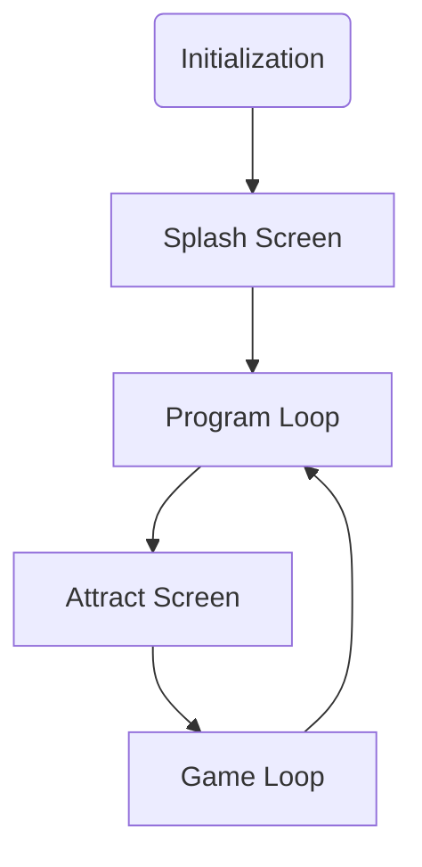

# Game Template

## Introduction

This is a template project for creating a game to run on the following neo-retro systems:

* Agon Light 2
* Aquarius+
* Commander X16
* ZX Spectrum Next

## Basic Game Structure

## Initialization

Each system is initialize to run as fast as possible and to provide roughly similar capabilities.

### Agon Light

* 320 x 240 screen resolution
* 64 color palette
* 64x32 tilemap 8x8 tiles
* 20Mhz ez80 CPU
* 24 bit address bus; available memory:
  * 512K without banking

### Aquarius+

* 320 x 200 screen resolution
* 4 x 16 color palettes
* 64x32 tilemap 8x8 tiles
* 7.16Mhz Z80 CPU
* 16 bit address bus; available memory:
  * ~50K without banking
  * 512K with banking

### Commander X16

* 320 x 240 screen resolution
* 256 color palette
* 64x64 tilemap 16x16 tiles
* 8Mhz 65C02S CPU
* 16 bit address bus; available memory:
  * ~38K without banking
  * 512K with banking

### ZX Spectrum Next

* 320 x 256 screen resolution
* 6 x 256 color palettes
* 40x32 tilemap 8x8 tiles
* 28Mhz Z80N CPU
* 16 bit address bus; available memory:
  * ~32K without banking
  * 768K with banking
