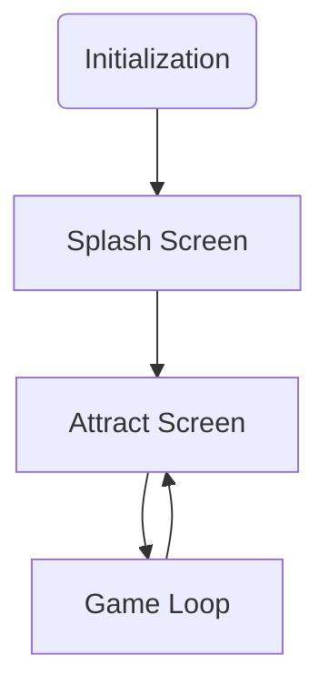

# Game Template

## Introduction

This is a template project for creating a game to run on the following neo-retro systems:

* Agon Light 2
* Aquarius+
* Commander X16
* ZX Spectrum Next

## Basic Game Structure

## Initialization

Each system is initialize to run as fast as possible and to provide roughly
similar [capabilities](#configured-capabilities).

The project declares one initialization function and each platform defines its own version of that function.
The initalization functions call several sub-functions than initialize different components.

One of theb reasons it is arranged this way is to make it easier to move those sub-functions to banked memory to leave space for the main game code.

### Sprites and Tiles

Both sprite and tile graphic data are defined in the same array and copied to the appropriate places in memory on initialization.

### Text overlay

The template uses a text overlay for showing the score and other information.

The Agon Light does not currently have the capability to provide a real text overlay so it has to be redrawn on every refresh. This is a relatively slow process. To mitigate this the text overlay is limited to as few lines as possible and the template uses the Agon's
double buffered screen mode to hide frame drops.

Even with this games will run noticably slower on the
Agon compared to the other systems.
Also because it is not a real overlay sprites will always appear above it.
The template hides this by limiting the area of the screen the sprites appear
in.

All the other systems have a real text overlay capability.

## Splash Screen

The splash screen is shown once immediately after the game loads.

Its purpose is to dispplay copyright and contact information and as a place to troubleshoot any
installation issues.

## Attract Screen

The attract screen is shown after the splash screen and
in between games. It shows the instructions for playing the game.

## The Game Loop

The game loop updates the screen and will read the players input.

## Configured Capabilities

### Agon Light

* 320 x 240 screen resolution
* 64 color palette
* 64x32 tilemap 8x8 tiles
* 20Mhz ez80 CPU
* 24 bit address bus; available memory:
  * 512K without banking

### Aquarius+

* 320 x 200 screen resolution
* 4 x 16 color palettes
* 64x32 tilemap 8x8 tiles
* 7.16Mhz Z80 CPU
* 16 bit address bus; available memory:
  * ~50K without banking
  * 512K with banking

### Commander X16

* 320 x 240 screen resolution
* 256 color palette
* 64x64 tilemap 16x16 tiles
* 8Mhz 65C02S CPU
* 16 bit address bus; available memory:
  * ~38K without banking
  * 512K with banking

### ZX Spectrum Next

* 320 x 256 screen resolution
* 6 x 256 color palettes
* 40x32 tilemap 8x8 tiles
* 28Mhz Z80N CPU
* 16 bit address bus; available memory:
  * ~32K without banking
  * 768K with banking
